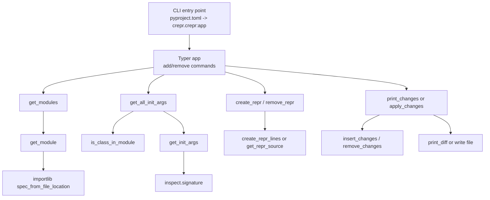
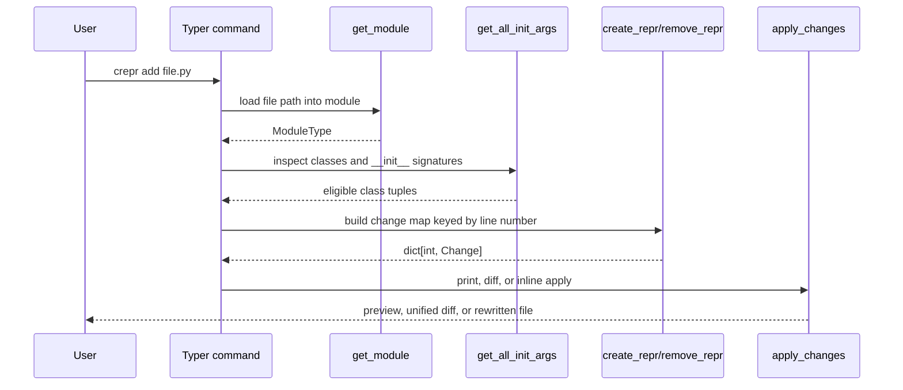

`crepr` is intentionally small. Almost all behavior lives in `crepr/crepr.py`, while `crepr/__init__.py` re-exports only `__version__` from `crepr/about.py`. That small footprint is useful for documentation because the public CLI, the helper functions, and the editing logic all share one source file.

## Module Relationships

## High-Level Flow

The CLI entry point is defined in `pyproject.toml` as `crepr = "crepr.crepr:app"`. That means the installed executable is the Typer application object created at the top of `crepr/crepr.py`. Both `add` and `remove` commands follow the same outer pipeline: load each file into a temporary module, collect candidate classes, compute changes, and then either print those changes, show a diff, or write back to disk.

The most important design choice is that `crepr` works from imported runtime objects rather than parsing Python syntax trees directly. `get_module` uses `spec_from_file_location` and `module_from_spec` to execute the target file as a uniquely named module. This makes `inspect.signature`, `inspect.getmembers`, and `inspect.getsource` available everywhere else in the pipeline. The trade-off is that the target file must be importable: syntax errors and missing imports fail before any `__repr__` generation happens.

## Why The Pieces Are Separated

`get_module`, `get_all_init_args`, `create_repr`, and `apply_changes` are kept separate because each stage answers a different question:

- Can the file be executed as a module?
- Which classes are local and have a supported constructor shape?
- What exact source lines should be inserted or removed?
- Should those changes be previewed, diffed, or written?

This separation makes the tests in `tests/run_test.py` granular. The suite checks import failures, unsupported constructor shapes, dataclass behavior, generated lines, diff output, and file writing as independent steps. That is a good sign that the boundaries in `crepr/crepr.py` are real architectural boundaries rather than arbitrary helper splits.

## Data Lifecycle

## Key Design Decisions

### Import the module instead of parsing the file

This choice comes from `get_module` and every helper that relies on `inspect`. The benefit is accuracy for normal Python definitions: `crepr` can ask the runtime for a constructor signature, method source, and class ownership without implementing a parser. The cost is execution risk. If the module imports something unavailable, `get_module` raises `CreprError`, and `get_modules` prints a red error message and skips that file.

### Only process classes defined in the target file

`is_class_in_module` compares `cls.__module__` with `module.__name__`. This avoids generating `__repr__` methods for imported symbols re-exported by a module. The tests use `tests/classes/only_imported_test.py` to confirm that no changes are produced when a file contains imports but no locally defined classes.

### Treat constructor shape as the contract

`get_all_init_args` only yields classes with an explicit `__init__` in `cls.__dict__` and only when `has_only_kwargs` returns `True`. In practice, that means classes with `POSITIONAL_OR_KEYWORD`, `KEYWORD_ONLY`, and `VAR_KEYWORD` parameters are supported, while `*args` is not. Dataclasses are also skipped because they do not define `__init__` directly in the class body.

### Work with line insertion and deletion maps

The generator returns `dict[int, Change]` rather than rewriting source immediately. That map is then consumed by `insert_changes` or `remove_changes`, both of which iterate in reverse line order so that earlier insertions or deletions do not invalidate later offsets. This is the core editing primitive for both `add` and `remove`.

## How The Pieces Fit Together

The library is best viewed as a four-stage pipeline: loading, class selection, line generation, and edit-mode execution. Each stage narrows uncertainty. By the time `apply_changes` runs, the library is no longer reasoning about Python objects. It is working with concrete source lines and exact insertion points. That explains why the CLI can offer three user-facing modes without duplicating the selection logic.

For a deeper walkthrough of each stage, continue with the core concept pages on discovery, filtering, generation, and edit modes.
