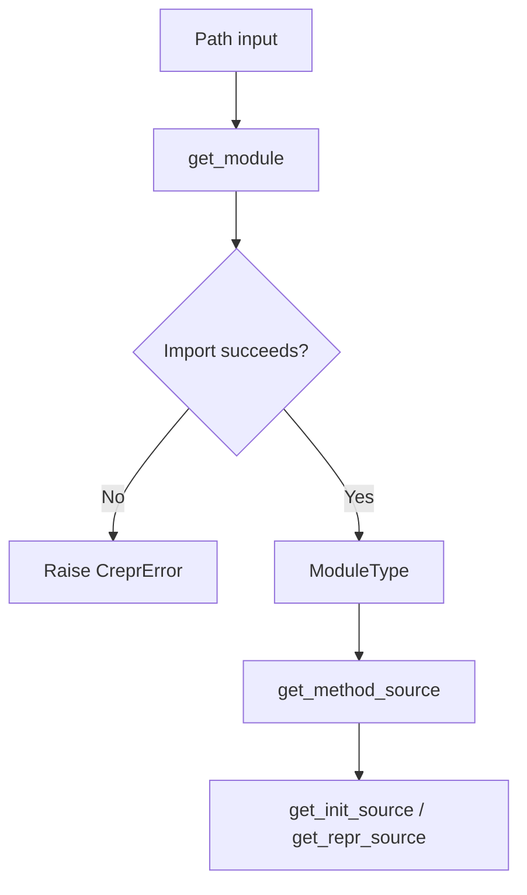

Discovery and loading is the first core concept in `crepr`: before the tool can generate a `__repr__`, it has to turn a path like `models.py` into a live `ModuleType` object. That logic lives in `crepr/crepr.py` and centers on `get_module`, `get_modules`, `get_method_source`, `get_init_source`, and `get_repr_source`.

## Why This Concept Exists

`crepr` needs more than raw text. It needs constructor signatures, method source locations, and access to the classes defined in a file. Instead of parsing Python tokens, the library imports the file with `importlib.util.spec_from_file_location`, executes it, and then uses `inspect` on the resulting module. This keeps the implementation compact and makes the later generation steps simpler because everything downstream deals with real Python objects.

## How It Relates To Other Concepts

Loading feeds every later stage:

- [Class Selection](/docs/class-selection) uses the loaded module to find eligible classes.
- [Repr Generation](/docs/repr-generation) relies on constructor signatures and source line numbers found during loading.
- [Edit Modes](/docs/edit-modes) depends on the loaded module source when printing diffs or rewriting files.

## Internal Walkthrough

`get_module(file_path: pathlib.Path) -> ModuleType` is the entry point. It builds a spec with a random UUID-backed module name, which avoids collisions when multiple files are loaded in one run. If a spec cannot be created, `crepr` raises `CreprError`. If the module fails during execution because of an import problem or syntax error, the function converts that exception into a user-facing `CreprError` with a short message.

`get_modules(files: Iterable[pathlib.Path]) -> Iterator[tuple[ModuleType, pathlib.Path]]` wraps `get_module` in a loop. This is why the CLI can accept multiple files and skip only the broken ones instead of aborting the whole run. The function catches `CreprError`, prints the message via `typer.secho`, and continues.

Method source recovery is handled by `get_method_source(cls: type, method_name: str) -> tuple[str, int]`. Both `get_init_source` and `get_repr_source` are thin wrappers around it. The helper intentionally checks `cls.__dict__` before using `inspect.getsource`, so inherited methods are ignored. That matters because `crepr` is designed to reason about methods actually declared on the class being modified.



## Basic Usage Example

The CLI uses this loading pipeline automatically:

```bash
crepr add tests/classes/kw_only_test.py
```

Under the hood, `get_module` imports the file and makes the `KwOnly` class available to `inspect.getmembers`. No file is changed yet; the command only prints the generated method because no output mode flag was passed.

## Advanced Example

The same loading behavior is available from Python if you want to script around `crepr`:

```python
from pathlib import Path
from crepr.crepr import CreprError, get_init_source, get_module

path = Path("tests/classes/kw_only_test.py")

try:
    module = get_module(path)
    cls = module.KwOnly
    source, line = get_init_source(cls)
    print(line)
    print(source)
except CreprError as exc:
    print(exc.message, exc.exit_code)
```

This is useful in tooling or editor integrations because it gives you the same import-and-inspect behavior as the CLI without rewriting files.

<Callout type="warn">Because `get_module` executes the target file, any top-level import errors or syntax errors stop inspection immediately. Use it on source files that can be imported safely in the current environment, and do not assume it behaves like a non-executing parser.</Callout>

<Accordions>
<Accordion title="Why importlib plus inspect instead of AST parsing?">
The current design keeps the code small and dependable for the cases `crepr` supports. Once the module is imported, `inspect.signature`, `inspect.getmembers`, and `inspect.getsource` provide almost everything the rest of the pipeline needs. An AST-based approach would avoid executing the file, but it would also require reimplementing signature recovery, source span tracking, and class ownership checks. For a single-purpose CLI, the import-based design trades safety for simplicity in a way that matches the repository size and test coverage.
</Accordion>
<Accordion title="What is the cost of executing the target module?">
Execution means side effects are real. If a module performs expensive setup, relies on unavailable dependencies, or mutates global state at import time, `crepr` inherits those risks because `get_module` runs the file. The tests in `tests/classes/import_error.py` and `tests/classes/c.py` show two practical failure modes: import errors and parse failures. If you need non-executing analysis, `crepr` is the wrong abstraction and an AST-based tool would be a better fit.
</Accordion>
</Accordions>

Discovery is the foundation for everything else. Once a module is loaded successfully, the next question is which classes `crepr` is willing to touch.
