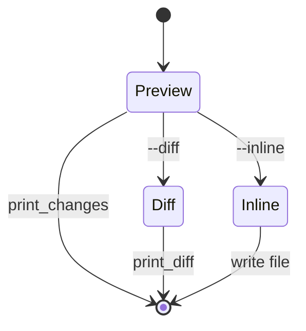

Edit modes are the user-facing execution layer of `crepr`. The selection and generation logic is the same regardless of output mode; what changes is how the resulting `Change` map is consumed. This concept is implemented by `print_changes`, `print_diff`, `apply_changes`, `insert_changes`, `remove_changes`, and the two Typer commands `add` and `remove`.

## What This Concept Is

`crepr` has three output behaviors for both adding and removing `__repr__` methods:

- No flag: print only the generated or removed method blocks.
- `--diff`: compute the new source and print a unified diff.
- `--inline`: compute the new source and write it back to the file.

This split exists so the tool can serve both interactive review workflows and direct code-modification workflows. It also explains why `add` and `remove` first compute abstract changes and only later decide how to materialize them.

## How It Relates To Other Concepts

[Repr Generation](/docs/repr-generation) produces the change map for `add`, while `remove_repr` produces an equivalent map for `remove`. Edit modes are what turn those maps into visible output or actual file edits.

## Internal Walkthrough

`insert_changes(module, changes)` and `remove_changes(module, changes)` both start from `inspect.getsource(module).splitlines()`. They then apply modifications in reverse line-number order. Reverse sorting is essential: if the tool inserted lines near the top first, every later insertion point would shift.

`apply_changes` is the mode switcher. It calls either `insert_changes` or `remove_changes`, then:

- uses `print_diff` when `diff` is `True`, or
- writes the new source to disk when `diff` is `False`.

If `diff` is `None`, `add` and `remove` never call `apply_changes`; they stay in preview mode and use `print_changes` instead.



## Basic Usage Example

Preview generated code without changing the file:

```bash
crepr add models.py
```

This is the safest mode for the first pass. You see the exact method body `crepr` wants to add, but the file stays untouched.

## Advanced Example

Use diff mode in CI or pre-commit style workflows:

```bash
crepr add models.py --diff
crepr remove legacy_models.py --diff
```

Because `print_diff` uses `difflib.unified_diff`, the output is easy to review and easy to pipe into other tools. When you are satisfied, rerun the same command with `--inline` to apply the change.

## Removal Workflow

`remove_repr(module)` uses the same class-selection logic as `add`, then calls `get_repr_source` for each eligible class to find the exact lines to delete. That means removal is not a generic “delete any method named `__repr__` in the file” pass. It only targets classes that would also qualify for constructor-based inspection. This keeps the implementation symmetrical, but it is important to understand when cleaning up mixed-style modules.

<Callout type="warn">Inline mode rewrites the file content directly with `"
".join(src)`. There is no backup file, formatting pass, or conflict detection. Use `--diff` first if you want a review step or if the file may have been edited concurrently.</Callout>

<Accordions>
<Accordion title="Why separate preview mode from diff mode?">
Preview mode prints only the method bodies, which is faster to scan when you care about the generated text itself. Diff mode adds surrounding context, file headers, and line-oriented patch markers, which is better for code review and automation but noisier for quick inspection. Keeping both modes makes the CLI more flexible without adding a separate command. The distinction also keeps the tests simple: one set checks raw generated output, another checks diff formatting.
</Accordion>
<Accordion title="What are the trade-offs of line-based insertion and deletion?">
Line-based edits are simple and transparent, but they assume the source recovered by `inspect.getsource(module)` matches the file on disk that will be rewritten. That is usually true in normal CLI usage, and it keeps the code very small. The downside is that this approach is sensitive to unusual formatting or source transformations that change line positions after import. A CST-aware editor could be more resilient, but it would also make the project much larger and harder to maintain.
</Accordion>
</Accordions>

With the core concepts in place, the guides show how to apply them in day-to-day workflows.
