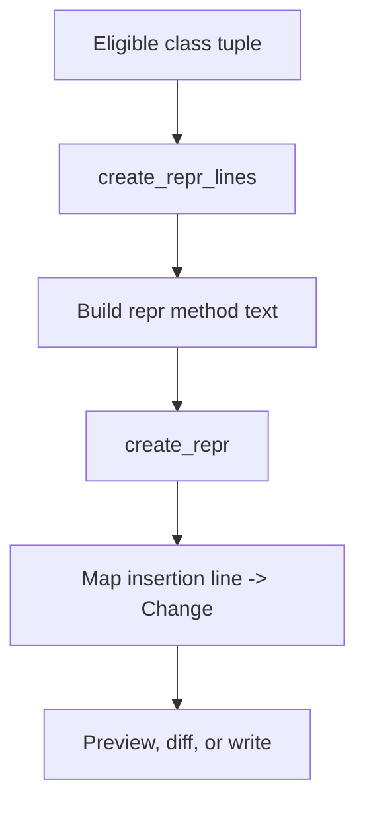

Repr generation is the stage where `crepr` stops reasoning about classes abstractly and starts emitting Python source lines. The core implementation lives in `create_repr_lines` and `create_repr` inside `crepr/crepr.py`.

## What This Concept Is

`create_repr_lines(class_name, init_args, kwarg_splat) -> list[str]` produces the actual text inserted into a file. It builds a method that returns a string containing the module name, the class name, and one formatted fragment per constructor parameter. `create_repr(module, kwarg_splat, ignore_existing) -> dict[int, Change]` then packages those lines into a line-number-indexed change map so the rest of the tool can preview or apply them.

This exists because the library wants a predictable, low-magic representation. The generated method always formats values with `!r`, always includes the fully qualified class name through `self.__class__.__module__` and `self.__class__.__name__`, and always inserts the new method immediately after the constructor source block.

## How It Relates To Other Concepts

Generation consumes the filtered results from [Class Selection](/docs/class-selection) and produces the change maps that [Edit Modes](/docs/edit-modes) later print, diff, or write.

## Internal Walkthrough

`create_repr_lines` starts with four fixed lines:

```python
[
    "",
    "    def __repr__(self) -> str:",
    f'        """Create a string (c)representation for {class_name}."""',
    "        return (f'{self.__class__.__module__}.{self.__class__.__name__}('",
]
```

It then iterates through the inspected constructor parameters, skipping `self`. Named parameters become fragments like `f"name={self.name!r}, "`. A `VAR_KEYWORD` parameter becomes a placeholder fragment like `f"**{},` by default, or another token if `--kwarg-splat` changes the placeholder.

`create_repr` decides where those lines belong. For each eligible class, it calculates the insertion position as `lineno + len(source)`, where `lineno` is the first line of `__init__` and `source` is the list of constructor source lines. That is why the method lands immediately after the constructor in generated examples and tests.



## Basic Usage Example

For a standard constructor:

```python
from typing import Self


class Product:
    def __init__(self: Self, sku: str, *, price: int) -> None:
        self.sku = sku
        self.price = price
```

`crepr add product.py` proposes:

```python
def __repr__(self) -> str:
    """Create a string (c)representation for Product."""
    return (f'{self.__class__.__module__}.{self.__class__.__name__}('
        f'sku={self.sku!r}, '
        f'price={self.price!r}, '
    ')')
```

## Advanced Example

`**kwargs` is the main supported edge case:

```python
from typing import Self


class Event:
    def __init__(self: Self, name: str, **kwargs: int) -> None:
        self.name = name
        self.kwargs = kwargs
```

Default output:

```bash
crepr add event.py
```

```python
def __repr__(self) -> str:
    """Create a string (c)representation for Event."""
    return (f'{self.__class__.__module__}.{self.__class__.__name__}('
        f'name={self.name!r}, '
        f'**{},'
    ')')
```

Custom placeholder:

```bash
crepr add event.py --kwarg-splat "kwargs=..."
```

The generated fragment changes to `f'**kwargs=...,'`, which can be easier to scan when you want the output to explain the omitted dynamic keys.

<Callout type="warn">`--ignore-existing` does not merge or replace an existing `__repr__`. In `add`, the flag flips the `create_repr` guard so the tool will insert another `__repr__` method even when one is already present in the class body.</Callout>

<Accordions>
<Accordion title="Why use fully qualified class names in the generated repr?">
The generated string starts with `self.__class__.__module__` and `self.__class__.__name__`, not just the bare class name. That makes the representation more useful in debugging sessions where several modules define classes with the same name. It also means subclasses display their runtime class correctly if the generated method is inherited or copied into a hierarchy. The trade-off is verbosity: the output is longer than a hand-written `User(name='x')` style repr, but it is less ambiguous.
</Accordion>
<Accordion title="Why generate source lines instead of building AST nodes?">
Line-based generation is enough for the very specific shape `crepr` emits. The code can stay readable, the tests can compare exact strings, and insertion points remain simple integer offsets. An AST-based implementation would make formatting and comments more complex, especially since the generated output is intentionally opinionated and stable. For this project, direct string assembly is easier to verify and easier to explain.
</Accordion>
</Accordions>

Once the change map is ready, the remaining question is how the user wants to consume it: as plain text, a diff, or a file mutation.
